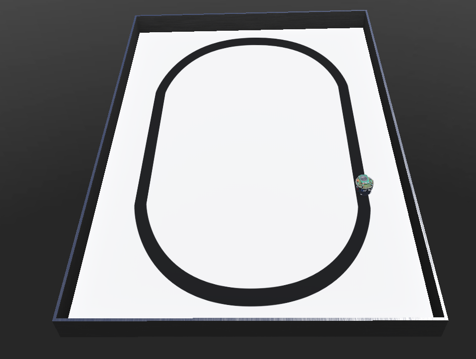

# 🤖 Webots Robot Controller: Line Following with e-puck 🚗

Welcome to the **Line Following Robot** project!  
This project demonstrates an autonomous robot in the **Webots simulation environment**, using the **e-puck robot** equipped with **three line sensors** and **two motors** to navigate a track.  
The robot utilizes a **proportional control algorithm** (PID-like) to keep itself on track.

## 🔧 Project Components

The robot (e-puck) is built with the following components:

- **Line Sensors** (👁️): Three ground sensors (left, center, right) detect the line on the track.
- **Motors** (🛠️): Two independent motors (left and right) control the robot's wheels.
- **Controller** (⚙️): A **simple proportional control algorithm** guides the robot's movement to stay centered on the line.

## 📝 Prerequisites

Before you get started, make sure you have:

- **Webots Simulation Software** (🖥️): Installed and set up.
- **e-puck Robot Model** (🤖): Provided within Webots or imported from its library.

## 🚀 How to Use

Follow these simple steps to run the simulation:

1. Load the code in the **Webots environment**.
2. Attach the **controller** to the **e-puck robot**.
3. Start the **simulation**. Watch the e-puck robot follow the line automatically! 🎯

## 🌍 Environment Image

Here’s a visual representation of the environment where the robot operates. It shows the track, e-puck robot, and sensors in the Webots simulation.

  

## 🧠 PID Controller Explanation

### ⚙️ Proportional Control (PID)

The robot follows the track using a **proportional control** algorithm. The **error term** is calculated based on the readings from the three ground sensors:
- **e = 0**: The center sensor detects the line — the robot moves straight ahead.
- **e = 1**: The right sensor detects the line — the robot steers left.
- **e = -1**: The left sensor detects the line — the robot steers right.

The motors are controlled by adjusting their speed based on a **proportional constant** `kp`.

### 💻 PID Code Implementation

```python
# Proportional control adjustment
kp = 50
u = kp * e
motor(BASE_SPEED + u, BASE_SPEED - u)
```

### 🔍 How the PID Code Works

- **Base Speed**: The e-puck’s default speed is set as a fraction of the maximum speed (`MAX_SPEED`).
- **Sensor Readings**: The robot reads the values from the left, center, and right ground sensors to detect its deviation from the track.
- **Error Calculation**: Calculates the deviation (`e`) from the center.
- **Motor Adjustment**: Adjusts the left and right motor speeds proportionally to correct the course.

## 🎯 Expected Outcome

Once the simulation starts, the **e-puck robot** will **autonomously follow** the line by adjusting its movement based on the sensor feedback. It will stay on the track by making real-time corrections based on the error values. 🚗💨
